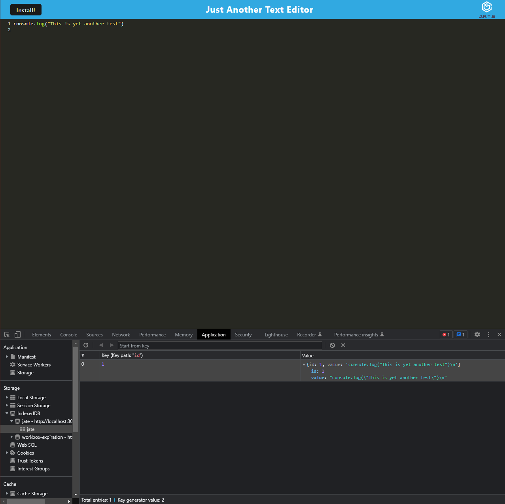

# Text Editor

## Description

The motivation and purpose behind this project was to create a text editor that can be used offline as well as installed onto any machine. It solves the problem of not having an offline and reliable text editor that can be used anywhere. I learned a lot about running scripts as well as generating service workers.

## Table of Contents

- [Installation](#installation)
- [Usage](#usage)
- [Credits](#credits)
- [License](#license)

## Installation

After cloning the repo and doing an initial npm install all the user has to do is go to the native `package.json` file and run the scripts

## Usage

Link to deployed heroku app: [here]()

## License

MIT License

A short and simple permissive license with conditions only requiring preservation of copyright and license notices. Licensed works, modifications, and larger works may be distributed under different terms and without source code.